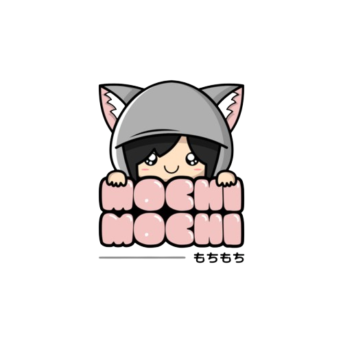

<a name="readme-top">

<br/>

<br />
<div align="center">
  <a href="https://github.com/your-github-username/">
  <!-- TODO: If you want to add logo or banner you can add it here -->
    
  </a>
<!-- TODO: Change Title to the name of the title of your Project -->
  <h3 align="center">Final Project</h3>
</div>
<!-- TODO: Make a short description -->
<div align="center">
  This website showcases my programming and designing skills as a freshman student under the specialization Web & Mobile Application in the program Information Technology. It features different website layouts for various features of this website. This also highlights some of my projects all throughout the school year under the course Web Design with Client-Side Scripting (IT0043).
</div>

<br />

<!-- TODO: Change the your-github-username into your github username  -->
<!-- TODO: Change the WD-Template-Project into the same name of your folder -->


---

<br />
<br />

<!-- TODO: If you want to add more layers for your readme -->
<details>
  <summary>Table of Contents</summary>
  <ol>
    <li>
      <a href="#overview">Overview</a>
      <ol>
        <li>
          <a href="#key-components">Key Components</a>
        </li>
        <li>
          <a href="#technology">Technology</a>
        </li>
      </ol>
    </li>
    <li>
      <a href="#rule,-practices-and-principles">Rules, Practices and Principles</a>
    </li>
    <li>
      <a href="#resources">Resources</a>
    </li>
  </ol>
</details>

---

## Overview

<!-- TODO: To be changed -->
<!-- The following are just sample -->
Description of the project in details.

- This project is for the final project requirement for the course <strong> IT0043L - Web Design with Client-Side Scripting </strong>. It showcases my programming and designing skills as a freshman student under the specialization Web & Mobile Application in the program Information Technology. It features different website layouts for various features of this website. This also highlights some of my projects all throughout the school year under the said course.

### Key Components
<!-- TODO: List of Key Components -->
<!-- The following are just sample -->
- MultiPage Website/Single Page Website

### Technology
<!-- TODO: List of Technology Used -->


## Rules, Practices and Principles
1. Always use `WD-` in the front of the Title of the Project for the Subject followed by your custom naming.
2. Do not rename any .html files; always use `index.html` as the filename.
3. Place Files in their respective folders.
4. All file naming are in camel case.
   - Camel case is naming format where there is no white space in separation of each words, the first word is in all lower case while the succeding words first letter are in upper followed by lower cased letters.
   - ex.: buttonAnimatedStyle.css
5. Use only `External CSS`.
6. Renaming of Pages folder names are a must, and relates to what it is doing or data it holding.
7. File Structure to follow below.

```
WD-Final-Project
└─ assets
|   └─ css
|   |   └─ Noto-Sans
|   |   |  └─ NotoSans.ttf
|   └─ img
|   |   └─ Changan.png
|   |   └─ Final-Project.png
|   |   └─ Francine_Bachiller.jpg
|   |   └─ Francine.jpg
|   |   └─ GAC.png
|   |   └─ Hands-on 2.png
|   |   └─ Hyundai.png
|   |   └─ KIA.png
|   |   └─ mochi-mochi.png
|   |   └─ Peugeot.png
|   |   └─ Resume.png
|   |   └─ Suzuki.png
|   |   └─ SW3.png
|   |   └─ SW4.png
|   |   └─ Wheels-2.jpg
|   |   └─ Wheels.png
└─ pages
|  └─ page1
|     └─ assets
|     |  └─ css
|     |  |  └─ style.css
|     └─ index.html
|  └─ page2
|     └─ assets
|     |  └─ css
|     |  |  └─ style.css
|     └─ index.html
|  └─ page3
|     └─ assets
|     |  └─ css
|     |  |  └─ style.css
|     └─ index.html
|  └─ page4
|     └─ assets
|     |  └─ css
|     |  |  └─ style.css
|     └─ index.html
└─ index.html
└─ readme.md
```

## Resources

<!-- TODO: Add References -->
| Title | Purpose | Link |
|-|-|-|
| Wheels, Inc. | Business content | https://www.wheelsinc.com.ph/ |
| FontAwesome | Icons | https://fontawesome.com/ |